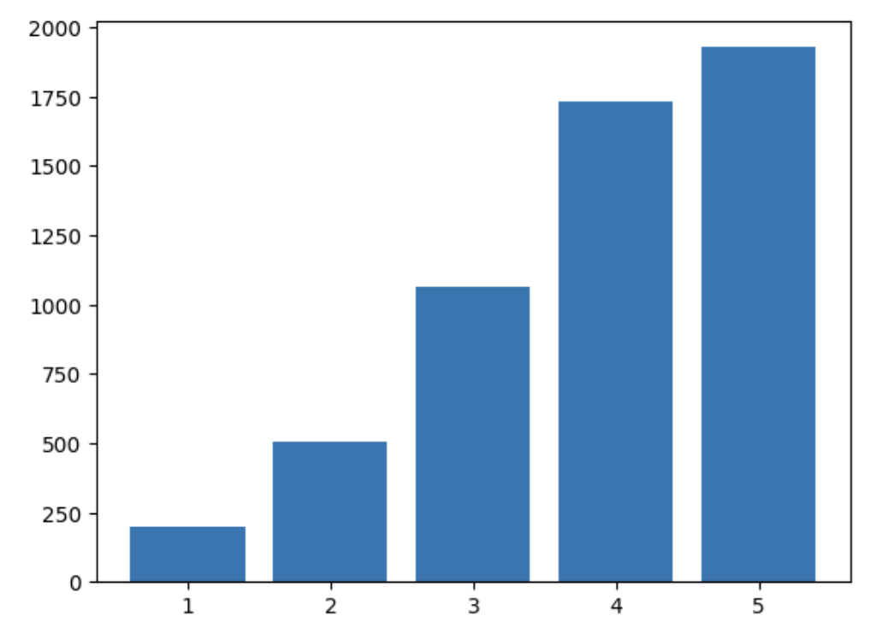

class: center
name: title
count: false

# "Our Vision for Rust"

## RustWeek 2025 Project Track

.center[Nicholas Matsakis, Jack Huey, Tim McNamara]

.left[.citation[View slides at `https://nikomatsakis.github.io/rustweek-25-project/`]]

---

# What is the vision doc?

Attempting to answer the question:

*What comes next for Rust?*

---

# Why the vision doc?

### It's time for us to think beyond "adoption"

--

### To help us stay focused

--

### To help us have some needed conversations

---

# Needed conversations?

Wearing my Amazon hat...

## Rust application domains

* At-scale network services in AWS
* Consumer devices

--

## Memory safety is a key enabler

Amazon bet big on Java and it paid off

--

## Ecosystem is great but...

* Rising regulatory requirements *vs* single-maintainer crates
* Upgrades make me nervous

---

# Research questions

## About Rust

* "What is Rust's mission?"
* "What do people value most in Rust? When do they choose to use Rust and why?"
* "What would help Rust to succeed in domain X?"
* "What would help Rust to succeed in area X?"

--

## About how we build Rust

* "How can we tap into the knowledge, experience, and enthusiasm of a growing Rust userbase to improve Rust?"
* "How can we make contributing to Rust **joyful?**"

---

# Part of a larger organizational story

* **Vision RFC:** "the lay of the land"
    * "Of the 22 companies we spoke to, 18 highlighted the need for C++ interop. Some use cases:"
        * Integrate into large extant codebase
        * Consume header files for embedded applications
    * "Better C++ interop would move the needle"
--
* **Flagship goals:** "big projects we want people to know about"
    * "Async" / "Rust for linux"
--
* **Project goals:** "tactical steps"
    * "Over the next 6 months we will prototype X"

---

# Idea: Northstar RFC

---

# Methodology
* Survey

--
* Interviews

--
* "Coding"

--
* ...

--
* **Blindingly brilliant _INSIGHT!_**

---

# Survey

* Make sure we’re not missing some critical area of interest
* Get a sense of common themes or experiences
* Gather candidates for interviews

---

# Three sections

* Quantitative “demographic” questions
* Free-form questions about experiences with Rust
* Contact info and references

---

# Overview stats

* Survey open April 4th - 28th
* 5498 responses (1162 provide contact info for an interview)

---

# Location

| Location | Number | Percentage |
| --- | --- | --- |
| Europe | 3114 | 57.8% |
| US / Canada | 1308 | 24.2% |
| Asia Pacific | 692 | 12.8% |
| Middle East and Africa | 156 | 2.8% |
| Latin America and the Caribbean | 116 | 2.1% |

---

# Quantitative questions

e.g., 

* “How comfortable do you feel writing code in Rust?” (1-5)
* “If you write code in Rust, is the code that you write in Rust…”
* “In what domains do you use Rust?”
* “For projects that you have not used Rust for, what programming language did you use instead?”

---

# Domains

“In what domains do you use Rust?”

| Domain | Number |
| --- | --- |
| CLIs | 3273 |
| Network services or cloud computing | 2701 |
| Embedded development | 1302 |
| Game development | 1139 |
| Machine learning or AI | 477 |
| I don't use Rust | 249 |
| Other | ... |

---

# Other prog lang

For projects that you have not used Rust for, what programming language did you use instead?

| Language | Number |
| --- | --- |
| Python (or similar) | 2894 |
| JavaScript / TypeScript | 1977 |
| C++ | 1603 |
| C | 1522 |
| Java or C# | 1437 |
| Bash | 1219 |
| Go | 981 |
| Only Rust | 280 |
| Other | ... |

--

.arrow.abspos.top490.left0[]

.abspos.top500.left120[.speech-bubble.barbara.left[High overlap with "I do not use Rust"]]

---

# Comfort with Rust

“How comfortable do you feel writing code in Rust?”

.center[.p60[]]

---

# Company size

“If you use Rust at work, how large is your company?"

.center[.p60[]]

---

# Free form questions

| Question | Responses |
| --- | --- |
| “How did you first get started using Rust? What was your experience like?” | 2610 |
| &nbsp; | |
| “What kinds of projects do you find to be a good fit for Rust and why? What do you find NOT to be a good fit?” | 2542 |
| &nbsp; | |
| “Is there anything that you found particularly challenging (or easy!) when learning or using Rust?” | 2435 |

---

# Some interesting themes

* Attempting then coming back
* Improving programming in other languages
* Language has improved considerably
* Learned Rust to replace another language (e.g. Python, C++)
* Very often only a couple weeks until productive (but there is a longer tail to a year)
* Often recommended by a friend

---

# Interviews

* 30-45 minutes
* Focus:
    * ask questions, let the user guide you
    * no wrong answers
    * Fun and...a bit challenging too

---

# Coding

---

# **Blindingly brilliant _INSIGHT!_**

---

# Conclusions

* Rust Vision Doc aims to give us insight into "the state of Rust"
* We are happy to have help
    * Thu morning coding session!
    * Come be an interviewer!
    * Talk to me or Jack!