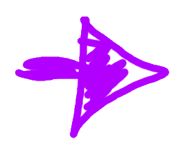

class: center
name: title
count: false

# "Our Vision for Rust"

## RustWeek 2025 Project Track

.p60[]

.me[.grey[*by* **Nicholas Matsakis**]]
.left[.citation[View slides at `https://nikomatsakis.github.io/rustweek-25-project/`]]

---

# Slide 1

You can put stuff here

---

# Code example

```rust
fn main() {
    println!("Hello, world");
}
```

--

.line1[]

You can add arrows like this!